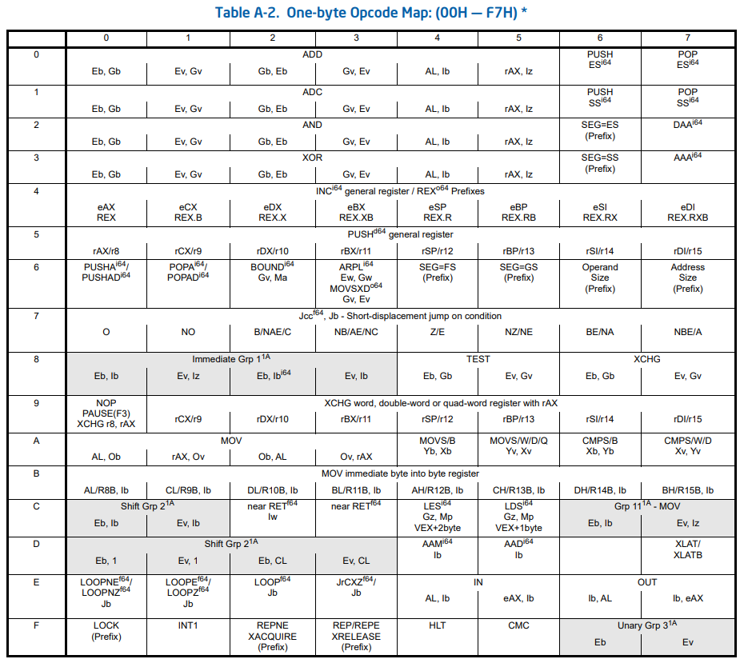

# Assembly Debugging 

어셈블리어 
어셈블리 언어 디버깅 방법 

먼저 학습목적으로는 64비트보다는 32비트 운영체제에서 학습 권장 
실무는 당연히 64비트겠지만 

F5 디버깅 시작 
F9 브레이크포인트 설정 
F10 현재 한 줄 실행, 다음 줄로 
F11 함수 내부로 진입 

호출스택 단축키 
Ctrl Alt C 

조사식 단축키 
Ctrl Alt W 

x86 아키텍쳐 지정된 목적의 레지스터 (CPU 내부 값)
esp Stack Pointer Register 
ebp  Base Pointer Register 

어셈블리어 단위 디버그 
F9 브레이크포인트 설정 
F5 디버깅 실행 
디스어셈블리 디버깅 모드 실행 
Ctrl Alt D
디버그 > 창 > 디스어셈블리 
보기 옵션 
코드 바이트 표시 주소 표시 소스코드 표시 기호이름 표시 줄 번호 표시 

조사식 창 
단축키 
Ctrl Alt W 
디버그 > 창 > 조사식 
내부에 ebp esp ecx 등 레지스터 검색도 가능 
우클릭 후 16진수 표시 누르면 16진법으로 표기됨 

호출 스택 창 
단축키 
Ctrl Alt C 
디버그 > 창 > 호출 스택 
우클릭 후 외부 코드 표시 누르면 main 함수 밖의 함수도 나옴 

메모리 창 
디버그 > 창 > 메모리 
열: 4열 추천, 16진수 4개 즉 메모리 4바이트 32비트씩 확인 가능 
내부 값 변경 가능, 메모리 내부 값 직접 접근 후 변경 가능 

레지스터 창 

디버그 > 창 > 레지스터 
32비트 기준 EAX EBX ECX EDX ESI EDI EIP ESP EBP EFL 다 확인 가능 

어셈블리어 에서 기계어 변환 과정에서, push (Register Name) 형식의 어셈블리어는 1바이트짜리 기계어로 변환이 되는 것을 확인했습니다. 예시로는 
```
00871810 55                   push        ebp  
```
이를 통하여 Intel Opcode 를 검색해 보았고, 특정 자주 사용되는 레지스터 값 스택 메모리에 push 하는 경우 경우 1바이트만에 처리할 수 있게 해 주는 opcode의 존재 확인 




어셈블리 코드 분석 

```
000719C0  push        ebp  
000719C1  mov         ebp,esp  
000719C3  sub         esp,0D8h 
```
여기서는 14 X 16 + 8 = 232 만큼의 공간 확보  
사실 변수도 없는 것, 스택은 메모리 공간을 확보하고 
변수는 그냥 스택 메모리 공간으로 고려함 
여기서, CPU 레지스터 관점과 RAM 메모리 관점을 다르게 할 필요가 있음 

스택과 CPU 상황 

스택 상황과 레지스터 상황을 동시에 고려해야 함 

push ebp // 스택 업데이트 
스택에 ebp의 값을 밀어넣음 
ebp 는 main 함수의 base pointer, 
main 함수의 스택 프레임 최상단 시작점이라고 볼 수 있음 
즉 main base pointer를 스택에 집어넣기 

mov ebp, esp 
레지스터 값 ebp = esp로 설정 
sub esp, 0E4H
레지스터 값 esp -= 0E4h로 설정 
push ebx
push esi
push edi 
스택에 ebx esi edi 레지스터 값을 밀어넣는 이유는 해당 함수의 
호출 프레임이 종료되고 상위 함수의 호출 스택으로 돌아갈 때 백업 때문 
하지만 이게 과연 필요한가는 의문 아무튼 현재 스레드 스택은 이러면 
[Higher Address  ]
[prev stack frame]
[main ebp address]
[main ebx address]
[main esi address]
[main edi address]
[216 Byte Area   ]
[Lower   Address ]
을 최하단에 저장하고 있을 것. 

즉 
```
000719C0 55                   push        ebp  
000719C1 8B EC                mov         ebp,esp  
000719C3 81 EC D8 00 00 00    sub         esp,0D8h  
000719C9 53                   push        ebx  
000719CA 56                   push        esi  
000719CB 57                   push        edi
``` 
까지는 함수 실행 이전 레지스터 값 백업 어셈블리어 실행이라고 볼 수 있음 
EBX ESI EDI 는 Callee saved Register로, 함수가 이들을 사용하면 
반드시 원래 값을 복원해야 하므로 백업이 필수적임 

```
0007181C 8D 7D D8             lea         edi,[ebp-28h]  
0007181F B9 0A 00 00 00       mov         ecx,0Ah  
00071824 B8 CC CC CC CC       mov         eax,0CCCCCCCCh  
00071829 F3 AB                rep stos    dword ptr es:[edi]  
``` 
먼저 edi Destination Index에 지역변수 시작 주소에 ebp - 28h 
Base Pointer - 16 X 2 + 8 = Base Pointer - 40 값 저장 

mov ecx, 0Ah 이거는 ecx Counter 레지스터 값을 10으로 설정, 반복 횟수로 사용될 예정 
mov eax, 0CCCCCCCCh 이거는 eax Accumulator 레지스터 값을 초기화하는 것 

rep stos dword ptr es:[edi] 

`stos` 는 StoreString 약자, stos의 실제 동작은 

1. eax 값을 [edi] 위치에 저장 
2. edi 값을 증가시킴, df 플래그에 따라 +4 또는 -4 
3. ecx 를 1 감소 

방향성 
일만적으로 DF (Direction Flag) = 0 이므르 edi는 증가한다 
edi는 

$ebp - 40 \rightarrow ebp - 36 \rightarrow ebp - 32 \rightarrow \dots \rightarrow ebp-4$
방향으로 이동 

1. edi Destination Index 위치에 eax 값 (0xCCCCCCCC) 4바이트 DWORD 를 저장 후 다음 DWORD 위치로 이동  
2. edi += 4 바이트, 다음 DWORD 위치로 이동 
3. ecx-- 0Ah 10으로 시작했던 Counter Register 감소 
4. ecx != 0 일 경우 (1)번으로 돌아가서 반복 

결론적으로 ebp-40부터 ebp-4까지 모든 메모리가 0xCCCCCCCC 값으로 초기화 
여기서 es는 과거 Segment Register, 16비트 컴퓨터 시대에 포인터 20비트 쓰고 싶어서 만든 공간 무시가능 

```
0007182B A1 00 A0 07 00       mov         eax,dword ptr [__security_cookie (07A000h)]  
00071830 33 C5                xor         eax,ebp  
00071832 89 45 FC             mov         dword ptr [ebp-4],eax  
00071835 B9 28 C0 07 00       mov         ecx,offset _12BD23D1_tmain@cpp (07C028h)  
0007183A E8 F5 FA FF FF       call        @__CheckForDebuggerJustMyCode@4 (071334h)  
0007183F 90                   nop  
```

조사식에서 

ebp, x 이러면 16진법 
ebp, b 이러면 2진법 이렇게 
ebp, d 이러면 10진법 
아니면 그냥 ebp 도 10진법 
ebp, o 8진법 

a b c d 앞에 역참조 
&a 이러면 주소 나옴 

