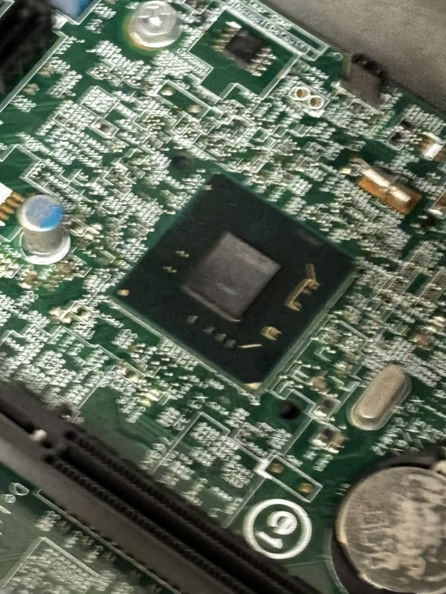

# Lab 01

ECE4820 FA2024 Introduction to Operating Systems

518370990004 Jae Heung Park

---

## 1 Hardware overview

### In the computer

The motherboard


A Hard Disk Drive


An Optical disk drive


The PC power supply


A PCI card

PCI card did not exist in computer disassembled during lab.

### On the motherboard

The RAM


A SATA socket


A PCI/PCI-e slot


The CPU


The North and South bridges



The battery


The BIOS


### Answer the following questions

- Where is the CPU hidden, and why?

CPU (Central Processing Unit) is located below a fan and
heat sink in CPU dismantled during lab.
CPU creates a lot of heat during computer is operating,
so it is necessary to have a cooling system attached to CPU.
Air cooling by fan is universal, but sometimes liquid based cooling
system can be used.

- What are the North and South bridges?

North and South bridges are chips only existing in old motherboard chips.
North Bridge controls CPU, RAM, internal Graphics Card interaction to be fast
South Bridge controls HDD, USB, or PCIs like external VGA.

- How are the North and South bridges connected together?

North & South Bridges are connected through a bus. In motherboard, bus
let data flow between these two bridges.

- What is the BIOS?

BIOS(Basic Input/Output System) is a firmware software saved in motherboard chip.
After the power is on, BIOS will be launched in computer,
initializing CPU and RAM to either start Operating Systems like
Windows or Linux, or changing setup.

- Take out the CPU, rotate it and try to plug it back in a different position, is that working?

CPU is specifically designed compatible for only certain type of socket.
Thus, CPU will be inserted only in the way it was inserted before.
Forcing different position will result in compromising both
CPU and motherboard CPU socket.

- Explain what overclocking is?

Instructed in ECE370 Computer organization course, CPU is
operating by each clock. More clocks per same time means
faster CPU operation, but more consumption of electricity and
creation of heat, so that CPU lifespan or even CPU circuit
might be compromised if cooling system cannot handle it.

- What are pins on a PCI/PCI-e card and what are they used for?

PCI PCI-e card pins connect PCI card to motherboard by their slots.
These pins will let PCI card to interact with data transfer to motherboard.
Thus, card and motherboard will communicate.
One of the most popular type of PCI PCI-e card are VGA (Video Graphics Array),
we call as external graphic cards like Nvidia RTX4090 or GTX1650.

- Before PCI-e became a common standard many graphics cards were using Accelerated Graphics
  Port (AGP), explain why.

AGP was specifically designed only for fast communication between
CPU and graphic card. Before PCI-e, AGP was standard since it had
better performance than PCI bus for data interaction with motherboard,
but PCI-e performance was better in speed and compatibility, so it replaced AGP.

## 2 Gitea usage

Register on our git server at http://focs.ji.sjtu.edu.cn/git. We will use Gitea all along the semester.
For the various group projects student must use git: part of their grade will be based on their commits.
Please closely follow the TAs’ instructions and ensure your are fully setup for the rest of the semester.
In particular by the end of the lab you should have uploaded your ssh public key on Gitea.

### 2.1 Git Usage

Basic git usage will be studied in a future lab. In the meantime get familiar with:

- Opening and using issues;
- Simple commands such as clone, commit, push, and pull;
- Using the Wiki and markdown, they will be used for the projects documentation;

### 2.2 Agile development with Gitea

In ECE482 we expect you follow the adgile development strategy which is adopted by most companies
nowadays. If you have any question of need further explanations feel free to ask. Here is a brief summary
of the expected Gitea workflow in the course.

## 3 Command line interface

### 3.1 Basic Unix commands

### 3.2 Shell scripting

### 3.3 Tasks

Answer the following questions, only refering to man pages:

#### Use the mkdir, touch, mv, cp, and ls commands to:

- Create a file named test.
- Move test to dir/test.txt, where dir is a new directory.
- Copy dir/test.txt to dir/test_copy.txt.
- List all the files contained in dir.

```shell
touch test
mkdir dir
mv test dir
ls dir
```

#### Use the grep command to:

List all the files form /etc containing the pattern 127.0.0.1.

```shell
grep -rl '127.0.0.1' /etc
```

Returned nothing

Only print the lines containing your username and root in the file /etc/passwd (only one grep should be used)

```shell
grep -rE 'root|jaeheungpark' /etc/passwd
```

Returns following

```text
/etc/passwd:root:*:0:0:System Administrator:/var/root:/bin/sh
/etc/passwd:daemon:*:1:1:System Services:/var/root:/usr/bin/false
/etc/passwd:_cvmsroot:*:212:212:CVMS Root:/var/empty:/usr/bin/false
```

#### Use the find command to:

List all the files from /etc that have been accessed less than 24 hours ago.

```shell
find /etc -atime -1
```

Returned nothing

List all the files from /etc whose name contains the pattern “netw”.

```shell
find /etc -name "*netw*"
```

Returned nothing

In the bash man-page read the part related to redirections. Explain the following operators >, >>,
<<<, >&1, and 2>&1 >. What is the use of the tee command.

Use `bash` instead of `zsh` terminal if you are MacOS user.
Simply type `bash` or `zsh` to switch.

#### `>` Output Redirection

Output Redirection redirect output from command to file.
If file already exists, it will be overwritten.

```shell
echo "Hello, Shell!" > output.txt
```

This will generate `output.txt` file or if it exists, overwrite
it with contents written as `Hello Shell!`.

#### `>>` Append Output Redirection

Append Output Redirection redirect output from command to file.
However, this time, command will be appended to originally existing file,
instead of getting overwritten.

```shell
echo "Hello, Again!" >> output.txt
```

#### `<<<` Here String

Here String provide input to command from string. When using grep,

`grep "find this" <<< "input sentence"`

```shell
grep "Hello" <<< "Hello, Shell!"
grep "World" <<< "Hello, Shell!"
```

First one will return `Hello Shell!` while the second one
will return nothing.

#### `>&1` Redirect to Standard Output

Redirect to Standard Output will make a file descriptor input to
a copy file descriptor 1. Generally, it is standard output.

```shell
ls non_existing_file
ls non_existing_file >&1
```

Both returns

```text
ls: non_existing_file: No such file or directory
ls: non_existing_file: No such file or directory
```

However, former one returns error, while latter one returns
output as standard output string.

#### `2>&1>` Order of Redirections

Order of redirections will redirect standard output to file.

```shell
ls non_existing_file > nofile.txt
ls non_existing_file > nofile.txt 2>&1
```

Formal one returns the following error on terminal.

```text
ls: non_existing_file: No such file or directory
```

However, latter one will create file named as nofile.txt as
a command file.

#### What is the use of the `tee` command.

The `tee` command will read from standard input and write as standard output.

```shell
echo "Hello, Shell!" | tee teefile.txt
echo "Hello, Again!" | tee -a teefile.txt
```

Former command creates output file first sentence.
Latter command adds output file second sentence.

#### Explain the behaviour of the `xargs` command

The `xargs` command will build and execute commands from standard input.

```shell
echo "file1 file2 file3" | xargs touch
echo "file1 file2 file3" | xargs rm
```

will create and remove file1 file2 file3.

#### The `|` pipe operator

The `|` pipe operator will take output of each command and
apply it as input. For instance,

```shell
ls -l | grep "txt"
```

will return

```text
-rw-r--r--@ 1 jaeheungpark  staff  47 Sep 22 15:19 nofile.txt
-rw-r--r--@ 1 jaeheungpark  staff  28 Sep 22 15:27 output.txt
-rw-r--r--@ 1 jaeheungpark  staff  28 Sep 22 15:28 teefile.txt
```

#### What are the head and tail commands? How to “live display” a file as new lines are appended?

`Head` commands display first few lines of file, 10 lines in default.
`Tail` commands display last few lines of file, 10 lines in default.
If live display of a file is required, type `tail -f file.txt`,
since `-f` represents follow.

#### How to monitor the system using ps, top, free, vmstat?

`ps` shows currently running processes.

```text
  PID TTY           TIME CMD
 2360 ttys000    0:00.11 /bin/zsh --login -i
 2362 ttys000    0:00.49 /Users/jaeheungpark/.cache/gitstatus/gitstatusd-darwin-arm64 -G v1.5.4 -s -1 -u -1 -d -1 -c -1 -m -1 -v FATAL -t 22
 3018 ttys000    0:00.02 bash
 3189 ttys000    0:00.86 zsh
```

`top` shows real time dynamic system process view including
CPU usage and memory usage. Command input `top` returns

```text
Processes: 659 total, 2 running, 657 sleeping, 3545 threads                                                                               15:57:40
Load Avg: 2.13, 1.97, 1.95  CPU usage: 3.19% user, 3.10% sys, 93.69% idle  SharedLibs: 765M resident, 149M data, 92M linkedit.
MemRegions: 169888 total, 5315M resident, 502M private, 3869M shared. PhysMem: 17G used (2236M wired, 761M compressor), 359M unused.
VM: 256T vsize, 4915M framework vsize, 0(0) swapins, 0(0) swapouts. Networks: packets: 3661368/5529M in, 2247373/2009M out.
Disks: 1271160/19G read, 399936/13G written.
mode [n]:
PID    COMMAND      %CPU TIME     #TH    #WQ  #PORT MEM    PURG   CMPRS  PGRP  PPID  STATE    BOOSTS          %CPU_ME %CPU_OTHRS UID  FAULTS
464    mobileassetd 13.5 00:20.36 7      5    201   14M-   0B     1824K  464   1     sleeping *7+[137]        0.04815 12.17135   0    7653+
0      kernel_task  7.5  24:37.01 576/11 0    0     9040K  0B     0B     0     0     running   0[0]           0.00000 0.00000    0    39329+
1104   clion        7.1  22:43.94 129    6    685+  1889M- 278M+  345M   1104  1     sleeping *0[1516]        0.04079 0.00000    501  1150909+
```

`free` shows different kinds of memory usage including total,
used, free, shared, buffer, cache, and available memories.

`vmstat` Shows virtual memory statistics including status of
memory, process, paging, block input, output, traps updated
per input second. For instance, `vmstat 1` will update
the output every second.

#### What are the main differences between sh, bash, csh, and zsh?

`sh` Shell is original basic shell, with the least amount of features

`bash` Bourne Again SHell is implemented shell version including
command history, job control, and array.

`csh` C shell is based on similar syntax to the programming language C.

`zsh` Z shell is configurable shell with several features from
both bash and csh. Currently shell of my M3 MacBook Pro OS is
using zsh shell.

#### What is the meaning of $0, $1,…, $?, $!?

`$0` Name of script / shell

`$1, $2, $3 ...` Arguments in order to get passed in script.

`$?` Exit status of last command. 0 means success while
other numbers represent fail.

`$!` Process ID of last background command.

#### What is the use of the PS3 variable? Provide a short code example.

PS3 variable can set prompt for select command in bash. For instance, this is possible.

```shell
PS3="Select option: "
select option in "Start" "Resume" "Quit"; do
  echo "You selected: $option"
  [[ $option == "Quit" ]] && break
done
```

#### What is the purpose of the `iconv` command, and why is it useful?

Purpose of `iconv` command is to convert text between different
character encodings systems like from ISO to UTF-8.
It is useful when working with files with different systems or
programs that have difference from standard format.

#### Given a variable $temp what is the effect of ${#temp}, ${temp%%word}, ${temp/pattern/string}.

`${#temp}` Return string length stored in `temp` variable

`${temp%%word}` Remove longest match of pattern word

`${temp/pattern/string}` Replace first `pattern` in `temp` containing `string`.

#### Search online (not in the man pages), how files are organised on a Unix like system.

In particular explain what are the following directories used for:

- `/:` Root directory, File System tree root.
- `/bin` Binaries, store basic user commands including `ls`, `mv`, `cp`.
- `/boot` Store bootloader files like kernel, initial RAM space.
- `/etc` Configuration files for OS & Applications
- `/lib` System libraries necessary for OS booting
- `/media` If media devices are connected or inserted in computer, OS will make corresponding directory here
- `/mnt` Temporary mounted files.
- `/usr/bin` User Binary files for User Applications
- `/usr/share` Sharable text files
- `/usr/lib` User Libraries required for `usr/bin`
- `/usr/src` Source codes for Linux Kernel
- `/proc` Virtual Filesystems with process and kernel info
- `/sys` Kernel interface with info view and configuration settings
- `/srv` Data for Services by system like web servers
- `/opt` Optional packages for subordinate directories
- `/var` Variable data including system logging files
- `/sbin` System binaries required for booting and system restoration
- `/dev` Device files representing hardware
- `/vmlinuz` Compressed Linux kernel used for booting
- `/initrd.img` Initial RAM space used by kernel for booting

Write a game where the computer selects a random number, prompts the user for a number, compares
it to its number and displays “Larger” or “Smaller” to the user, until the player discovers the random
number initially chosen by the computer.

Execute by command

```shell
chmod +x game.sh
./game.sh
```

Code works well.
