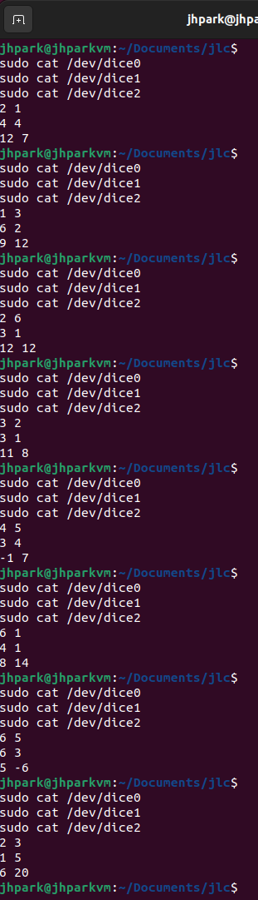

# Lab 09

ECE4820 FA2024 Introduction to Operating Systems

518370990004 Jae Heung Park

---

## 1 Project 3: presentations (part 1)

Presentation

## 2 Introduction

Reading

## 3 A dice module

You remember that for what you want to implement, a character device should at least match the `open`,
`close`, `read`, and `write` system calls. You will also have to decide on a major and a minor for your
dice device. By definition the major must correspond to the driver associated to the device so it cannot
“freely” choose it. However, the minor is more flexible and you can pass it to the driver. You therefore
decide to use it to create more than one type of dice device: each type would feature a different minor
corresponding to a different type of dice. The displayed result of a roll would then depend on the minor.
That being set, you now want to specify more precisely how to implement your devices, but for that
you need grandpa’s help. What kind of game does he want to play? How many players there would be?
Based on his answers it appears that you need to implement the following options:

- Change the number of dice by a `write` on the device;
- Display the result of a roll by a `read` on the device;
- Use the minor to specify the type of dice when creating the device;
- Depending on the type of dice display a different output;
- Use a module option to set the number of sides for a generic type of dice;

Based on his answers you quickly get a sketch of what you will do, and show it to him to ensure you
match all his expectations. You will have three main types of dice:

- (i) regular,
- (ii) backgammon, and
- (iii) generic

featuring an arbitrary number of sides.
For this latter dice the side number should be specified as a module option.

```text
$ #regular dice
$ echo 2 > /dev/dice0
$ cat /dev/dice0
------- -------
| o o | | o o |
| o o | | o |
| o o | | o o |
'-----' '-----'
```

```text
$ #backgammon die
$ echo 1 > /dev/dice1
$ cat /dev/dice1
16
```

```text
$ #generic dice, gen_sides=20
$ # gen_sides: module option
$ echo 3 > /dev/dice2
$ cat /dev/dice2
12 19 8
```

As grandpa is perfectly happy with your idea you decide to carry on with it.

## 4 Tasks

First you want to make sure you are fully familiar with the kernel API for creating character devices. So
you ask yourself the following questions.

### What needs to be returned by read and write file operations for a character device?

Operation `read` should return the number of bytes read from device to provide data to user buffer.
If no more data exist to be read, return 0, meaning EOF (End Of File).
Errors should return negative value like `-EINVAL`.

Operation `write` should return the number of bytes that are written to device.
It should process user provided data and return negative value in error case.
Common error is `-EFAULT`, a failure to access user memory.

### How are exactly those major and minor numbers working? You vaguely remember that you can display them using ls -l /dev.

**Major Number** identify device associated drivers.
OS kernel will use these major numbers to locate appropriate driver required when device file is accessed.

**Minor Number** specifically identifies particular device managed by drivers.
Single driver could operate several devices and those subordinate drivers will be minor number.

Display major numbers and minor numbers in Linux OS by following command.

```shell
ls -l /dev
```

### Knowing the major number and minor numbers of a device, how to add a character device to /dev?

Add character device to `/dev` by using `mknod` command.

```shell
mknod /dev/<device_name> c <major_num> <minor_num>
mknod /dev/dice0 c 250 0
```

### Where are the following terms located in linux source code?

| Term                  | Location              | Description                                                        |
| --------------------- | --------------------- | ------------------------------------------------------------------ |
| `module_init`         | `linux/init.h`        | Macro for defining the initialization function of a kernel module. |
| `module_exit`         | `linux/init.h`        | Macro for defining the cleanup function of a kernel module.        |
| `printk`              | `linux/kernel.h`      | Used for logging kernel messages.                                  |
| `container_of`        | `linux/kernel.h`      | Retrieves the containing structure from a pointer to a member.     |
| `dev_t`               | `linux/types.h`       | Represents device numbers (combines major and minor numbers).      |
| `MAJOR`               | `linux/kdev_t.h`      | Extracts the major number from `dev_t`.                            |
| `MINOR`               | `linux/kdev_t.h`      | Extracts the minor number from `dev_t`.                            |
| `MKDEV`               | `linux/kdev_t.h`      | Combines major and minor numbers into a `dev_t`.                   |
| `alloc_chrdev_region` | `linux/fs.h`          | Allocates device numbers dynamically.                              |
| `module_param`        | `linux/moduleparam.h` | Defines module parameters.                                         |
| `cdev_init`           | `linux/cdev.h`        | Initializes a character device structure.                          |
| `cdev_add`            | `linux/cdev.h`        | Registers a character device with the kernel.                      |
| `cdev_del`            | `linux/cdev.h`        | Removes a character device from the kernel.                        |
| `THIS_MODULE`         | `linux/module.h`      | Macro referring to the current kernel module.                      |

### How to generate random numbers when working inside the Linux kernel? You think that a while back you read something about getting the current time.

Linux kernel has random number generator functions in `linux/random.h` including

- `get_random_int()`
- `get_random_bytes(void *buf, int nbytes)`

### How to define and specify module options?

Linux kernel has module parameter macro `module_param` function in `linux/moduleparam.h`.

```c
static int gen_sides = 20;
module_param(gen_sides, int, 0444);
MODULE_PARM_DESC(gen_sides, "Total number of generic dice sides");
```

Pass module options at load time

```shell
insmod dice.ko gen_sides=12
```

Where `0444` specify permission (Read only for all), while `MODULE_PARM_DESC` is text description

> As you can answer all those questions it feels that you are almost ready to get started, so you open your
> favorite tool to code and write a very basic module which on a cat simply prints “Almost there grandpa!”.

A few useful references:

- https://github.com/starpos/scull
- https://www.oreilly.com/library/view/linux-device-drivers/0596005903/ch03.html
- https://elixir.bootlin.com/linux/latest/source

### Compile and test log in Linux

Supports three types of dice

- Regular Dice: `/dev/dice0`
- Backgammon Dice: `/dev/dice1`
- Generic Dice: `/dev/dice2`

Implementation

- `write` to set dice number to roll.
- `read` to display dice rolls.

Set dice number to roll (`write`), `?` is number

```shell
echo <number> > /dev/dice?
```

Read dice number to roll (`read`), `?` is number

```shell
cat /dev/dice?
```

Compile by `make` command and clean by `make clean`

```shell
make
make clean
```

Check generated dice

```shell
ls -l /dev/dice*
```

Check file contents

```shell
sudo cat /dev/dice0
```

Returns following

```text
1 3
```

Check logs

```shell
sudo dmseg | tail
```

Logs contents

```text
sudo dmesg | tail
[    7.878369] audit: type=1107 audit(1733345694.330:59): pid=819 uid=102 auid=4294967295 ses=4294967295 subj=unconfined msg='apparmor="DENIED" operation="dbus_method_call"  bus="system" path="/org/freedesktop/PolicyKit1/Authority" interface="org.freedesktop.PolicyKit1.Authority" member="CheckAuthorization" mask="send" name=":1.3" pid=1598 label="snap.snap-store.ubuntu-software" peer_pid=832 peer_label="unconfined"
                exe="/usr/bin/dbus-daemon" sauid=102 hostname=? addr=? terminal=?'
[    7.880613] audit: type=1107 audit(1733345694.332:60): pid=819 uid=102 auid=4294967295 ses=4294967295 subj=unconfined msg='apparmor="DENIED" operation="dbus_method_call"  bus="system" path="/org/freedesktop/PolicyKit1/Authority" interface="org.freedesktop.DBus.Properties" member="GetAll" mask="send" name=":1.3" pid=1598 label="snap.snap-store.ubuntu-software" peer_pid=832 peer_label="unconfined"
                exe="/usr/bin/dbus-daemon" sauid=102 hostname=? addr=? terminal=?'
[    7.880708] audit: type=1107 audit(1733345694.332:61): pid=819 uid=102 auid=4294967295 ses=4294967295 subj=unconfined msg='apparmor="DENIED" operation="dbus_method_call"  bus="system" path="/org/freedesktop/PolicyKit1/Authority" interface="org.freedesktop.PolicyKit1.Authority" member="CheckAuthorization" mask="send" name=":1.3" pid=1598 label="snap.snap-store.ubuntu-software" peer_pid=832 peer_label="unconfined"
                exe="/usr/bin/dbus-daemon" sauid=102 hostname=? addr=? terminal=?'
[    8.039953] audit: type=1400 audit(1733345694.491:62): apparmor="DENIED" operation="open" class="file" profile="snap.snap-store.ubuntu-software" name="/etc/appstream.conf" pid=1598 comm="snap-store" requested_mask="r" denied_mask="r" fsuid=1000 ouid=0
[ 8096.679822] audit: type=1326 audit(1733352979.809:63): auid=1000 uid=1000 gid=1000 ses=2 subj=snap.snap-store.ubuntu-software pid=1598 comm="pool-org.gnome." exe="/snap/snap-store/1217/usr/bin/snap-store" sig=0 arch=c00000b7 syscall=55 compat=0 ip=0xf8108010910c code=0x50000
[10648.110448] dicedevice: loading out-of-tree module taints kernel.
[10648.110513] dicedevice: module verification failed: signature and/or required key missing - tainting kernel
```

Verify device noce

```shell
ls -l /dev/dice*
```

Test reading from device

```shell

sudo cat /dev/dice0
sudo cat /dev/dice1
sudo cat /dev/dice2
```


This is success result image.
